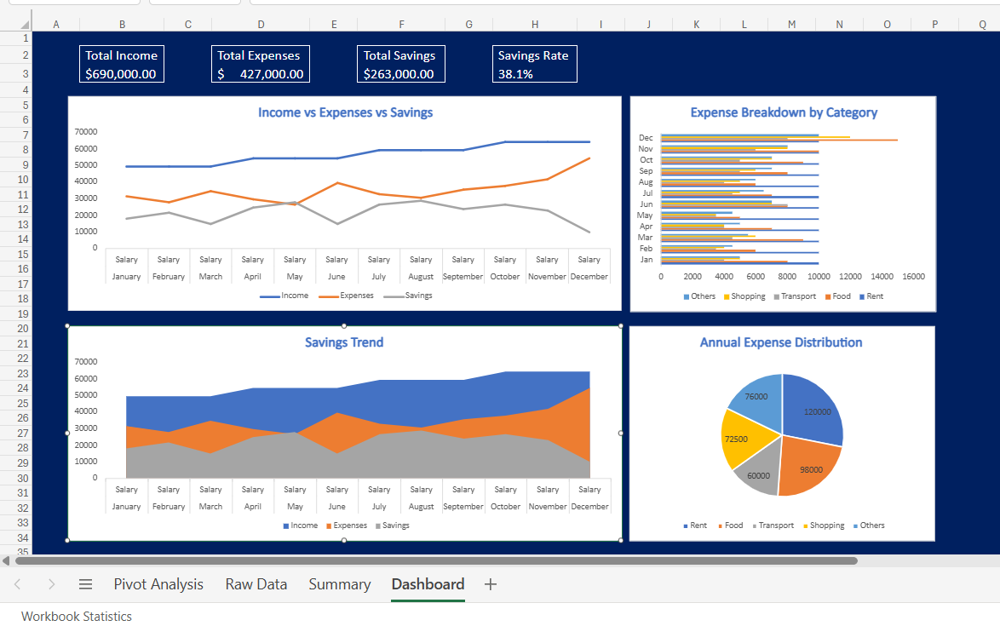

# Personal Finance & Budget Dashboard | Excel

Built an interactive financial dashboard tracking 12 months of income, 
expenses, and savings data.

## 📊 Dashboard Preview

## Features
- KPI Cards (Total Income, Expenses, Savings, Savings Rate)
- Monthly trend line chart (Income vs Expenses vs Savings)
- Expense category breakdown (Bar Chart)
- Annual expense distribution (Pie Chart)
- Savings trend visualization (Area Chart)
- Pivot Table analysis

## Skills Used
Excel Formulas (SUM, AVERAGE, INDEX-MATCH), Pivot Tables, 
Conditional Formatting, Data Visualization, Dashboard Design
